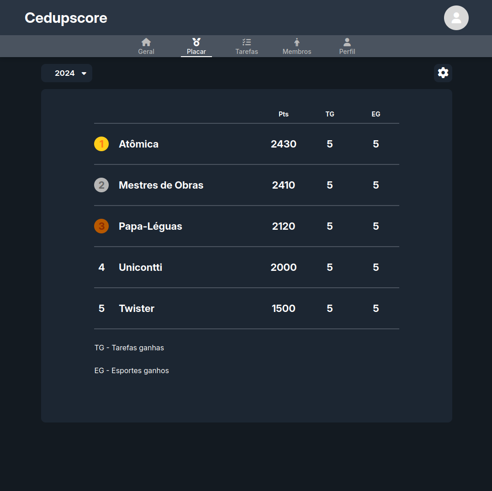

# Cedupscore

Sistema para o gerenciamento da *gincana* do colégio CEDUP Abílio Paulo desenvolvido como *projeto integrador* apresentado para a obtenção do grau de *Técnico em Informática* no curso integrado do CEDUP.

## Sumário

- [Sobre](#sobre)
- [Demonstração](#demonstração)
  - [Tela de placar](#tela-de-placar)
  - [Tela de tarefas](#tela-de-tarefas)
  - [Tela de detalhes da tarefa](#tela-de-detalhes-da-tarefa)
  - [Tela de participantes](#tela-de-participantes)
  - [Tela de manipulação de arquivos de participantes](#tela-de-manipulação-de-arquivos-de-participantes)
- [Estrutura](#estrutura)
  - [Estrutura do backend](#estrutura-do-backend)
  - [Estrutura do frontend](#estrutura-do-frontend)
- [Rodando o projeto](#rodando-o-projeto)
  - [Configurações gerais](#configurações-gerais)
    - [MySQL](#mysql)
    - [Chaves de autenticação](#chaves-de-autenticação)
    - [Lombok](#lombok)
  - [Rodando em modo de desenvolvimeto](#rodando-em-modo-de-desenvolvimento)
  - [Rodando em modo de produção](#rodando-em-modo-de-produção)

## Sobre

O objetivo do sistema é fornecer uma plataforma de gerenciamento que facilite o controle de atividades relativas a gincana, bem como a disseminação de informações sobre a mesma, como placares de tarefas, datas e horários, pontuações das equipes e outros dados.

## Demonstração

### Tela de placar

Nesta tela, é exibido o placar da edição atual da gincana. Também é possível selecionar edições anteriores para consultar seus placares. Usuários autorizados têm acesso a um botão de ações na página, que oferece opções de gerenciamento para a edição atual.



### Tela de tarefas

Esta tela lista as tarefas de uma edição específica, com a edição atual pré-selecionada ao abrir a página. Quando acessada por um usuário autorizado, a tela exibe um botão de ações que fornece um link direto para a página de cadastro de tarefas.


### Tela de detalhes da tarefa

Nesta tela, é possível visualizar em detalhe os dados de uma tarefa específica, incluindo todos os participantes nela inscritos. Quando acessada por um usuário autorizado, a tela exibe um botão de ações com opções para exclusão, edição e inscrição de participantes na tarefa. A opção de inscrição de participantes é exibida apenas quando a tarefa possui o status "agendada", garantindo que o processo de inscrição seja controlado conforme o estágio da tarefa.


### Tela de participantes

Esta tela exibe uma lista paginada de todos os participantes, tanto os inscritos na edição atual quanto em edições anteriores da gincana. Para facilitar a busca, é possível localizar um participante específico por nome e/ou CPF, além também de poder filtrar a listagem por dados específicos. Por padrão, os participantes são listados em ordem de inscrição, começando pelos mais recentes, mas a listagem pode ser reordenada em ordem alfabética, tanto ascendente quanto descendente. Usuários autorizados têm acesso a um botão de ações na página, fornecendo links diretos para a página de cadastro de participantes e para a página de manipulação de arquivos de participantes.


### Tela de manipulação de arquivos de participantes

Esta tela, acessível apenas para usuários autorizados, permite a manipulação em massa dos dados dos participantes por meio de arquivos CSV. As operações disponíveis incluem o cadastro e inscrição de novos participantes na edição atual da gincana, bem como a atualização do status de participantes já registrados. Essa funcionalidade facilita a administração eficiente de grandes volumes de dados, garantindo agilidade e precisão no gerenciamento dos inscritos.


## Estrutura

O projeto está particionado em dois subdiretórios, cada um com seu próprio repositório, sendo eles: `/backend`, contendo uma API desenvolvida com Spring Boot, e `/frontend`, construído com Angular.

### Estrutura do backend

```bash
src
└── main
    ├── java
    │   └── com
    │       └── bristotartur
    │           └── cedupscore_api
    │               ├── controllers
    │               ├── domain
    │               ├── dtos
    │               │   ├── request
    │               │   └── response
    │               ├── enums
    │               ├── exceptions
    │               ├── handlers
    │               ├── infra
    │               │   └── security
    │               ├── mappers
    │               ├── repositories
    │               └── services
    └── resources
```

- `/controllers`: Contém todos os endpoints da API;
- `/domain`: Definição das entidades que representam o modelo de dados do sistema;
- `/dtos`
  - `/request`: DTOs utilizados em requisições para a API;
  - `/response`: DTOs retornados como resposta dos endpoints da API;
- `/enums`: Enumerações utilizadas para definir valores constantes no sistema;
- `/exceptions`: Exceções customizadas do projeto;
- `/handlers`: Tratadores de exceções, responsáveis por padronizar as respostas de erro da API;
- `/infra`
  - `/security`: Implementação de segurança e autenticação da aplicação;
- `/mappers`: Interfaces para mapear entidades para DTOs e vice-versa
- `/repositories`: Interfaces para acesso ao banco de dados, relacionadas às entidades do *domain*;
- `/services`: Classes que encapsulam a lógica de negócio do sistema;
- `/resources`: Configurações gerais e outros arquivos importantes do projeto.

### Estrutura do frontend

```bash
src
├── app
│   ├── core
│   │   └── ...
│   ├── edition
│   │   ├── ...
│   ├── home
│   │   └── ...
│   ├── participant
│   │   ├── features
│   │   ├── models
│   │   ├── services
│   │   └── ui
│   ├── shared
│   │   ├── ...
│   ├── task
│   │   └── ...
│   └── user
│       ├── ...
├── environments
└── styles
```

- `/core`: Contém componentes principais, como o cabeçalho (*header*) e o layout base das páginas (*page-body*);
- `/edition`: Componentes, *models*, *services* e tudo relacionado à edições da ginana;
- `/home`: Componentes específicos da *home page*;
- `/participant`
  - `/features`: Componentes inteligentes ([*smart components*](https://blog.angular-university.io/angular-2-smart-components-vs-presentation-components-whats-the-difference-when-to-use-each-and-why/)), representando funcionalidades, além de rotas relacionadas a participantes (essa estrutura também se repete em outras pastas, como `/edition` e `/task`);
  - `/models`: Modelos para objetos relacionados a participantes (essa estrutura também se repete em outras pastas, como `/edition` e `/task`);
  - `/services`: Conexão com a API;
  - `/ui`: Componentes visuais (*presentational/dumb components*) que não possuem muitas responsabilidades (essa estrutura também se repete em outras pastas, como `/edition` e `/task`);
- `/shared`: Componentes, *models*, *guards*, *pipes* e diversos recursos compartilhados e utilizados por todo o projeto;
- `/task`: Componentes, *models*, *services* e tudo relacionado à tarefas da ginana;
- `/user`: Componentes, *models*, *services* e tudo relacionado a usuários;
- `/environments`: Configurações específicas para diferentes ambientes de execução ;
- `/styles`: Arquivos globais de estilização.

## Rodando o projeto

Primeiramente, clone o repositório do projeto:

```bash
git clone https://github.com/bristotartur/cedupscore.git
```

Para rodar o projeto será necessário:

- [JDK versão 21](https://www.oracle.com/br/java/technologies/downloads/#java21) ou superior;
- [Node.js](https://nodejs.org/pt);
- [Angular versão 18](https://angular.dev/) ou superior (opcional);
- [MySQL](https://www.mysql.com/) (necessário apenas para execução em modo de produção).

O projeto possui dois modos de execução: **desenvolvimento** e **produção**. O modo de desenvolvimento, ou `dev`, sobe uma instância de [H2 Database](https://www.h2database.com/html/main.html) em memória, descartando a necessidade da configuração de um banco de dados. Já o modo de produção, ou `prod`, requer o banco de dados MySQL, que terá sua configuração posteriormente explicada.

### Configurações gerais

#### MySQL

Para rodar o projeto em modo de produção certifique-se de possuir o MySQL instalado em sua máquina ou, se preferir, a [imagem oficial do MySQL](https://hub.docker.com/_/mysql) disponível no Docker Hub.

Após instalar o MySQL, crie um banco chamado `db_cedupscore` e duas variáveis de ambiente com o `username` e `password` do banco. Caso esteja em `linux`, execute os seguintes comandos:

```bash
# Exemplo em ubuntu

echo 'export DB_USERNAME="username_do_banco"' >> ~/.bashrc
echo 'export DB_PASSWORD="senha_do_banco"' >> ~/.bashrc
source ~/.bashrc
```

Ou, caso esteja em um ambiente `Windows`:

```shell
# Exemplo via cmd

setx DB_USERNAME "username_do_banco"
setx DB_PASSWORD "senha_do_banco"
```

#### Chaves de autenticação

O sistema usa [tokens JWT](https://jwt.io/) como autenticação, que necessitam de encriptação para serem criados. A criptografia utilizada é feita por meio de `chaves RSA` e devem ser geradas para a utilização da API do sistema.

Caso você esteja em um ambiente `linux` este processo será um pouco mais simples. Abra o terminal na raíz do projeto e dirija-se para o diretório `/resources` dentro de `/backend`:

```bash
cd ./backend/src/main/resources
```

Gere uma chave privada chamada de `app.key`:

```bash
openssl genrsa > app.key
```

Com a chave privada, gere uma chave pública chamada `app.pub`:

```bash
openssl rsa -in app.key -pubout -out app.pub
```

Caso esteja em um ambiente `Windows` este processo pode ser um pouco mais complexo. Algumas opções como o uso de `chaves SSH` podem ser uma solução, como mostrado no [Microsoft Learn](https://learn.microsoft.com/en-us/viva/glint/setup/sftp-ssh-key-gen), mas lembre-se de que as chaves devem ser chamadas de `app.key` e `app.pub`.

#### Lombok

Caso queira rodar o projeto por uma IDEA, precisará antes configurá-la para suportar o `Lombok`, que é uma das dependências utilizadas no `backend`. Em algumas IDEs, basta instalar o plugin do Lombok, que está disponível nos principais editores de texto, como Intellij e Vscode. Para alguns editores, será necessário realizar uma configuração mais específica para o suporte da dependência, o que pode ser conferido no [site oficial do Lombok](https://projectlombok.org/).

### Rodando em modo de desenvolvimento

Abra a pasta do projeto em seu terminal de preferência e incialize a API.

```bash
cd ./backend
./mvnw spring-boot:run
```

As dependências necessárias serão instaladas na primeira vez, o que pode demorar um pouco. Caso a execução do programa ocorra corretamente, você verá os seguintes logs no terminal:

```bash
2024-12-14T10:58:29.724-03:00  INFO 460126 --- [cedupscore-api] [  restartedMain] o.s.b.d.a.OptionalLiveReloadServer       : LiveReload server is running on port 35729
2024-12-14T10:58:29.771-03:00  INFO 460126 --- [cedupscore-api] [  restartedMain] o.s.b.w.embedded.tomcat.TomcatWebServer  : Tomcat started on port 8080 (http) with context path '/'
2024-12-14T10:58:29.784-03:00  INFO 460126 --- [cedupscore-api] [  restartedMain] c.b.c.CedupscoreApiApplication           : Started CedupscoreApiApplication in 7.801 seconds (process running for 8.3)
```

Para inicializar o `frontend`, volte para a raíz do projeto e execute o seguinte comando:

```bash
cd ./frontend
npm install
```

Após instalar as dependências, você poderá rodar o projeto.

```bash
ng serve
```

Ou, caso não possua o Angular instalado:

```bash
npx @angular/cli@18 serve
```

Após inicializar o frontend, você pode acessar `http://localhost:4020` e utilizar o sistema :)

### Rodando em modo de produção

Abra a pasta do projeto em seu terminal de preferência e incialize a API especificando o *profile* de produção:

```bash
cd ./backend
./mvnw spring-boot:run -Dspring-boot.run.profiles=prod
```

Caso a execução do programa seja bem sucedida, você verá os seguintes logs no terminal:

```bash
2024-12-14T14:14:16.169-03:00  INFO 505403 --- [cedupscore-api] [  restartedMain] o.s.b.d.a.OptionalLiveReloadServer       : LiveReload server is running on port 35729
2024-12-14T14:14:16.208-03:00  INFO 505403 --- [cedupscore-api] [  restartedMain] o.s.b.w.embedded.tomcat.TomcatWebServer  : Tomcat started on port 8081 (http) with context path '/'
2024-12-14T14:14:16.225-03:00  INFO 505403 --- [cedupscore-api] [  restartedMain] c.b.c.CedupscoreApiApplication           : Started CedupscoreApiApplication in 8.043 seconds (process running for 8.493)
```

Para inicializar o `frontend`, volte para a raíz do projeto e execute o seguinte comando:

```bash
cd ./frontend
npm install     # caso ainda não tenha instalado as dependências
```

Realize o *build* da aplicação com o seguinte comando:

```bash
ng build --configuration=prod
```

Ou (caso não possuir o Angular instalado):

```bash
npx @angular/cli@18 build --configuration=prod
```

Após realizar o *build*, inicialize o programa passando a flag `--configuration=prod`:

```bash
ng serve --configuration=prod

# ou

npx @angular/cli@18 --configuration=prod
```

Após inicializar o frontend, você pode acessar `http://localhost:4020` e utilizar o sistema :)
